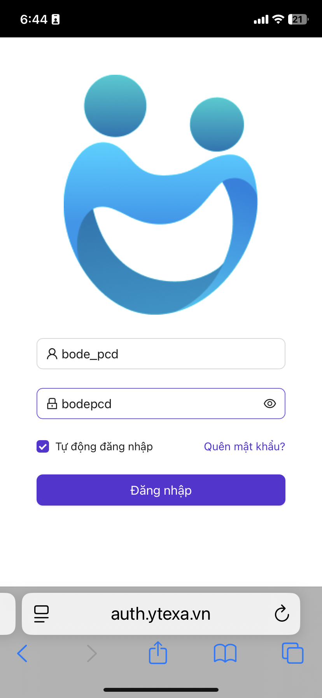
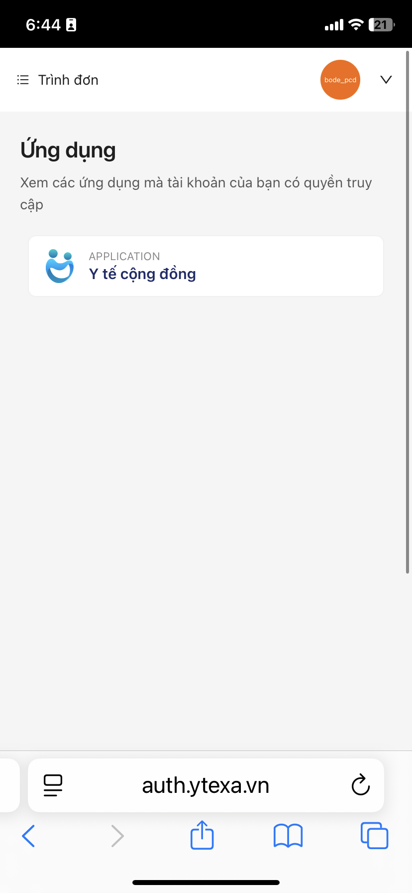
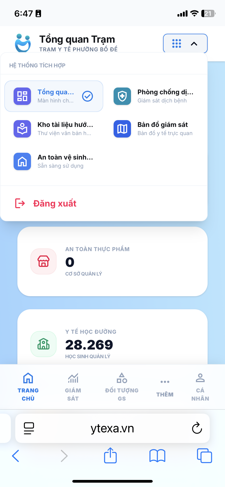
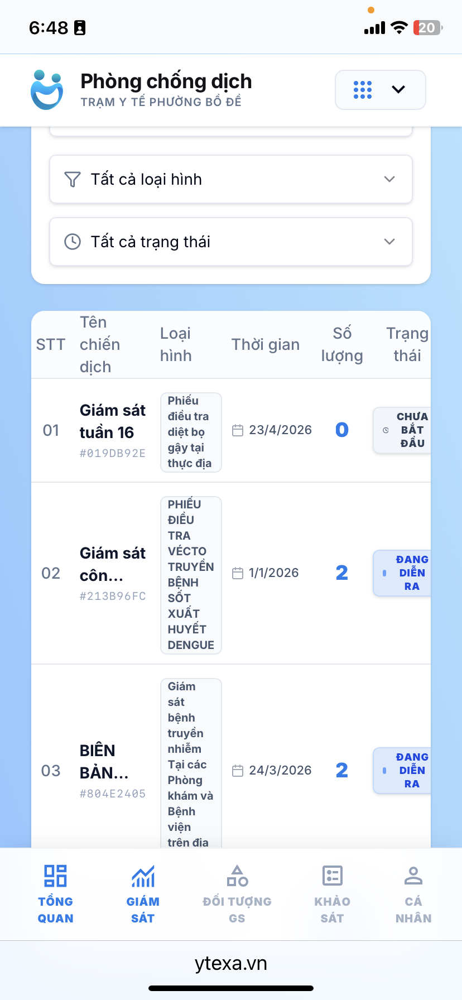
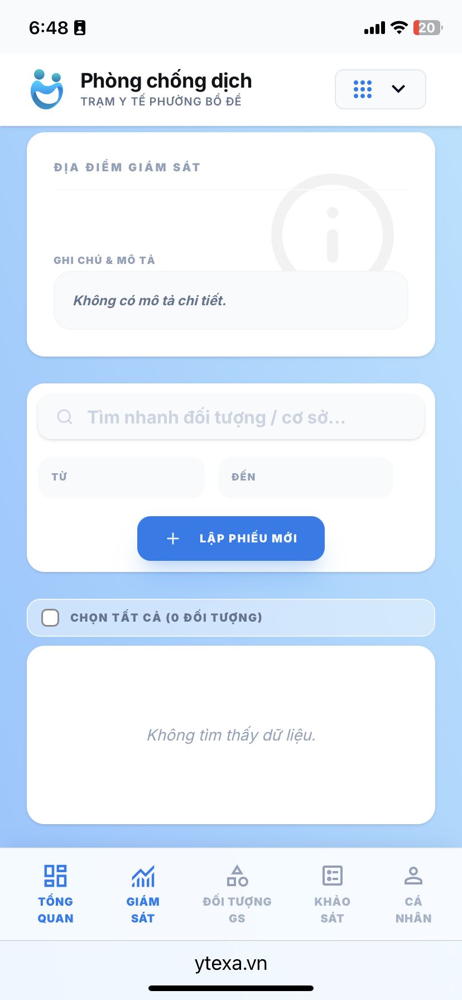
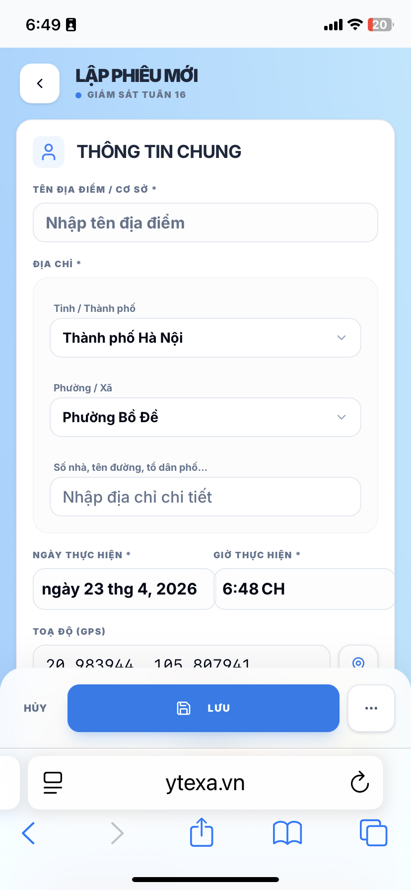

# Hướng dẫn sử dụng ứng dụng Y tế Cộng đồng

Ứng dụng **Y tế Cộng đồng** hỗ trợ cán bộ y tế thực hiện giám sát phòng chống dịch tại thực địa một cách nhanh chóng và chính xác.

---

## 1. Đăng nhập hệ thống

1. Truy cập địa chỉ: [ytexa.vn](https://ytexa.vn). Hệ thống sẽ tự động chuyển sang màn hình đăng nhập.
2. Nhập **Tên đăng nhập** và **Mật khẩu** đã được cấp.
3. Nhấn **Đăng nhập**.

Sau khi đăng nhập thành công, tại màn hình chọn ứng dụng, chọn chức năng **Phòng chống dịch**.

---

## 2. Truy cập danh sách giám sát

1. Tại màn hình Tổng quan, chọn mục **Giám sát** ở thanh điều hướng dưới để vào danh sách các chiến dịch giám sát.

2. Tìm và chọn **Chiến dịch giám sát** tương ứng đang được triển khai.

---

## 3. Thực hiện giám sát tại hộ gia đình

Khi đến địa điểm cần giám sát, thực hiện các bước sau:

1. Nhấn nút **Bắt đầu giám sát** (hoặc **Lập phiếu mới**) để thực hiện giám sát.

2. Điền các thông tin giám sát vào biểu mẫu:
    - **Tên địa điểm / Cơ sở**: Nhập tên **hộ giám sát**.
    - **Tọa độ**: Nhấn vào **icon cạnh ô tọa độ** để lấy vị trí hiện tại chính xác của địa điểm giám sát.
    - Điền đầy đủ các thông tin chuyên môn khác có trong phiếu.

3. Sau khi hoàn thành, nhấn **Lưu biên bản**.

4. **Tiếp tục tạo mới biên bản** tương tự khi di chuyển sang hộ tiếp theo.

---

> [!TIP]
> Luôn kiểm tra lại tọa độ GPS trước khi lưu để đảm bảo dữ liệu được ghi nhận đúng vị trí thực tế.
